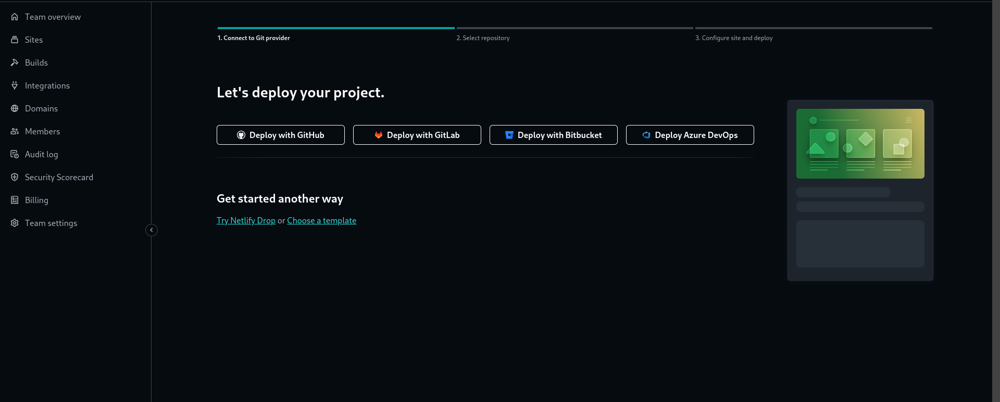
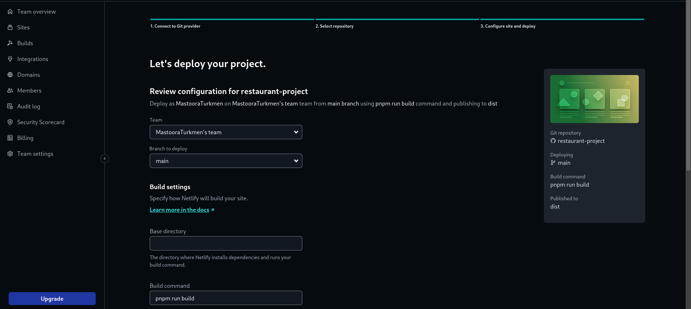
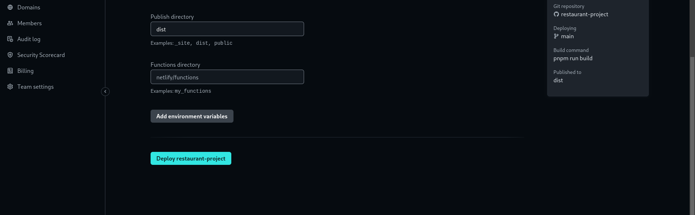

# Simple Food Restaurant Project 🍔 🌭

## Before you Begin 🔨

How to start your project in local machine

```
$ npm install
$ npm start
````

```
$ pnpm install
$ pnpm run dev
```

## For cloning the project 🪛

```
# Clone this repository
$ gh repo clone MastooraTurkmen/restaurant-project

# Go inside the repository
$ cd restaurant-project

```

------

## Deployment 📦

+ How to deploy our project to netlify site?
   1. I use [Netlify App](https://app.netlify.com/) for deploying my projects.
   2. Go to Netlify site and select Add a new site.
   3. From here select **_Deploy with Github_**
       
   4. After selecting here you can see that the project **_Review configuration for restaurant-project_** and then select the _Deploy restaurant-project_ Button
       
       


